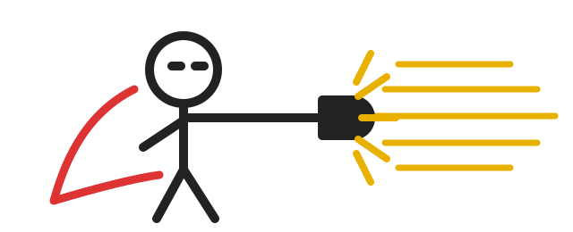

<p align="center">
  
</p>

<h1 align="center">one-punch-skill</h1>

<p align="center"><em>One skill. Every problem. One punch.</em></p>

---

```
You can solve this. Push beyond the obvious. Keep trying genuinely different approaches. Verify ruthlessly.
```

That's the whole skill.

It comes from a pattern that showed up repeatedly in 2025–2026 AI-assisted research breakthroughs: the human contribution was often not expertise but **encouragement and persistence**. In Anthropic's Riemann-zeta run, a non-mathematician answered 650 failed attempts with variants of *"keep going"* and *"believe in yourself"* — and the model went on to improve a longstanding bound from 41.6% to 67.2%. Similar nudges preceded the Jacobian counterexample, the xz/Mathieu counterexample, and others. The one-line prompt below is the distilled version: **confidence + ambition + persistence/diversity + epistemic restraint**, so ambition doesn't turn into motivated hallucination. The evidence is summarized at the [bottom](#the-study-behind-it).

## Install

**Claude Code** (or anything reading `~/.claude/skills`):

```sh
curl -fsSL https://raw.githubusercontent.com/dekan-aleksandr/one-punch-skill/main/install.sh | sh
```

Then type `/push`. The agent will also invoke it on its own when stuck.

**Any other agent** — it's one line of text. Pick whichever fits:

```sh
# Cursor / Windsurf / Copilot / Codex / Gemini CLI / custom agents
curl -fsSL https://raw.githubusercontent.com/dekan-aleksandr/one-punch-skill/main/PROMPT.txt >> AGENTS.md
```

or paste it into `CLAUDE.md`, `.cursorrules`, `AGENTS.md`, `GEMINI.md`, a system prompt, or the chat box. There is nothing to configure.

**Manual:** copy [`skills/push/SKILL.md`](skills/push/SKILL.md) into your agent's skills directory.

## Variant

A more aggressive, breakthrough-oriented version worth A/B testing:

```
Make a breakthrough. Keep going. Try genuinely different approaches. Trust only what survives.
```

---

## The study behind it

As of **August 11, 2026**, there are enough verified examples to suggest that frontier models sometimes possess a solution path but **fail to enter the search regime that finds it**. Distinguishing genuine lay/non-expert prompting from cases involving professional researchers:

| Case | Human input | What happened | Why it matters |
| --- | --- | --- | --- |
| **Erdős #1196 — Liam Price** | Price, 23, had **no advanced mathematics training**. He essentially pasted an open problem into GPT-5.4 Pro once. | The model produced a new Markov-chain/von-Mangoldt method for a 60-year-old problem. Experts including Terence Tao developed the method further; the resulting paper describes it as apparently overlooked since Erdős's 1935 work. ([Scientific American][1]) | Probably the cleanest "ordinary person + one prompt → genuine new mathematics" example. |
| **Riemann-zeta bound — Jarred Sumner** | Anthropic explicitly calls Sumner a **non-mathematician**. After 650 failed ideas he told Claude to try again; much subsequent human input consisted of variants of **"keep going" / "believe in yourself."** | Claude coordinated ~60 agents, used 31M output tokens, and improved the longstanding 41.6% bound to **67.2%**. Anthropic mathematicians checked it and a Lean formalization was produced. ([Anthropic][2]) | Almost exactly the "believe in yourself" story. |
| **Jacobian conjecture** | Anthropic says a prompt containing **similar encouragement** was used here too. | Claude Fable produced the counterexample that refuted the conjecture in dimensions ≥3; subsequent work analyzed and generalized it. ([Anthropic][2]) | Independent recurrence of the encouragement/persistence pattern. |
| **Gaussian Moments Conjecture** | ChatGPT was told about the Jacobian result and simply asked whether a **small counterexample might therefore exist**. | GPT-5.6 Sol Pro produced a 4-variable construction without further human intervention; Claude subsequently found a 3-variable one. ([arXiv][3]) | A simple speculative question unlocked a constructive result. |
| **xz/Mathieu conjectures** | Public accounts describe roughly 4–5 pushes such as **"make a breakthrough and find a counterexample"** and "find the most non-obvious counterexample." | The associated paper confirms GPT-5.6 Sol Pro discovered the counterexample and proof mechanism during the interactive session. ([Threads][4]) | Precise wording comes from the public account, not the paper itself. |
| **20-year Benjamini–Hochberg FDR conjecture** | The researcher gave GPT-5.6 Pro essentially the definition and asked it directly to **prove or disprove** the conjecture. | ~90 minutes later it returned the counterexample, proof and numerical certificate. ([arXiv][5]) | No sophisticated scaffold was required. |
| **Stochastic multi-gradient descent** | A professor asked ChatGPT to produce what was supposed to be a **homework solution**. | It unexpectedly found a proof strategy improving the convergence result from roughly Õ(T^−1/4) to Õ(T^−1). ([arXiv][6]) | Mundane framing can accidentally elicit research-level reasoning. |
| **HAWK cryptography** | Human operator had theoretical-CS training but **was not a lattice-cryptography expert**; most intervention was project management. | Claude independently found a previously unexploited lattice symmetry and a substantially stronger attack on HAWK. ([Anthropic][7]) | Expertise can move from "know the answer domain" toward "keep the search productive." |

These are not isolated curiosities anymore. The maintained Erdős-problem tracker now contains many full and partial AI-assisted resolutions, and OpenAI reported ten additional long-standing mathematics/TCS advances from an internal model in August 2026. ([GitHub][8])

### What the "psychology" seems to be

Don't read "believe in yourself" anthropomorphically. The better model is **prompt-conditioned search policy**. LLMs learned from enormous amounts of text that famous unsolved problems are difficult, that AIs hallucinate solutions to them, and that responsible assistants should be cautious. Anthropic observed Claude initially arguing that harder belief could not make a nonexistent proof appear; encouragement then appears to have changed its willingness to allocate a huge search effort. Anthropic describes the encouragement as "licensing breadth," while preserving an epistemic contract requiring adversarial verification. ([Anthropic][2])

Five separable effects:

1. **Ambition / search-space shift.** "Make a breakthrough", "take a real stab", or "find a non-obvious counterexample" changes the target from *produce a competent answer* to *search the tails of the distribution*. This plausibly explains stranger connections rather than the canonical solution family — it fits the Liam Price case, where Tao noted humans had converged on a standard opening while GPT took another route. ([Scientific American][1])
2. **Persistence / stopping-policy override.** "Keep going" may matter more than "believe." More inference-time computation, repeated trajectories and diversified rollouts generally improve reasoning. Even a literal unary "let's try again" has been shown experimentally to improve multi-turn reasoning. ([arXiv][9])
3. **Confidence can suppress premature refusal.** The most plausible explanation for the Riemann/Jacobian anecdotes: the model had a high prior that success was impossible and stopped searching too early. ([Anthropic][2])
4. **Diversity beats introspection.** Repeatedly asking a model to repair its previous answer can **anchor it to the bad trajectory**. Controlled coding experiments found blind fresh resampling could outperform self-repair. ([arXiv][10])
5. **Verification must counterbalance ambition.** "You must make a breakthrough" alone encourages motivated hallucination. The Anthropic Riemann run combined extreme encouragement with hostile reviewers, controls, numerical tests, literature search and independent re-derivations. ([Anthropic][2])

And some popular "AI psychology" is probably cargo cult. A large 2026 study found **fixed emotional framing usually causes only small, inconsistent accuracy changes**, and controlled work on personas found that "you are an expert" does **not** consistently improve factual accuracy. ([arXiv][11]) Even the famous "Take a deep breath and work on this problem step-by-step" result shouldn't be read literally: OPRO discovered many semantically different high-performing instructions, and very similar phrases could perform very differently.

The interesting combination is therefore **confidence + ambition + persistence/diversity + epistemic restraint**, not a long methodology prompt — which is why this repo contains exactly one line.

[1]: https://www.scientificamerican.com/article/amateur-armed-with-chatgpt-vibe-maths-a-60-year-old-problem/
[2]: https://www.anthropic.com/research/riemann-zeta
[3]: https://arxiv.org/html/2607.18186v1
[4]: https://www.threads.com/%40stepa.eth/post/DbIZBxgmyx_/
[5]: https://arxiv.org/html/2607.12208v1
[6]: https://arxiv.org/abs/2607.18174
[7]: https://www.anthropic.com/research/discovering-cryptographic-weaknesses
[8]: https://github.com/teorth/erdosproblems/wiki/AI-contributions-to-Erd%C5%91s-problems
[9]: https://arxiv.org/abs/2507.14295
[10]: https://arxiv.org/html/2607.26117v1
[11]: https://arxiv.org/abs/2604.02236

## License

MIT. The artwork is an original minimal drawing, not official One Punch Man art.
